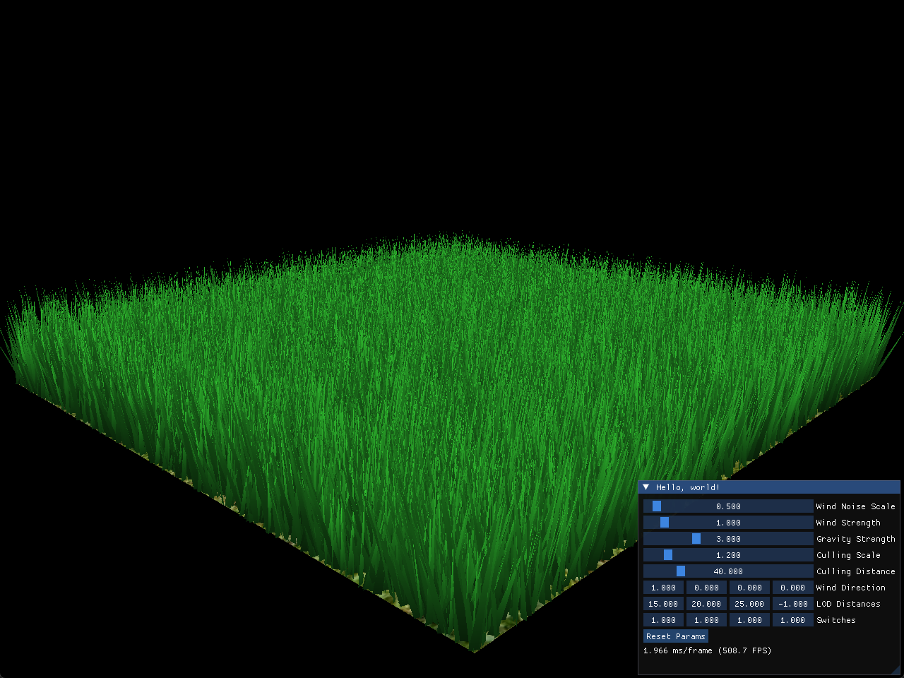
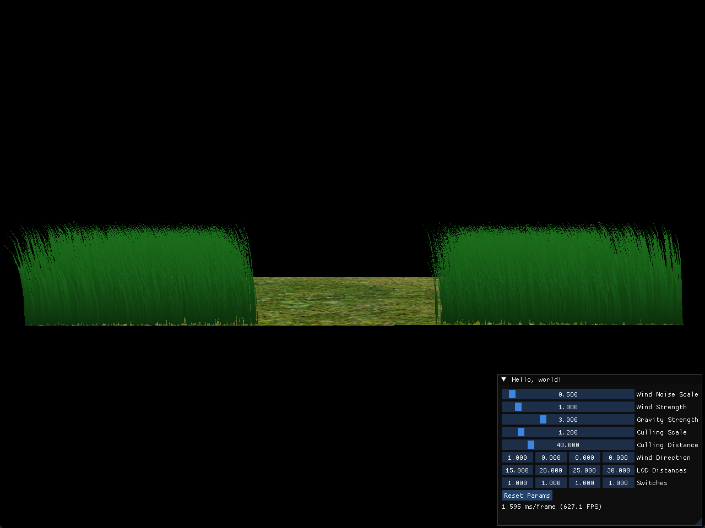

Vulkan Grass Rendering
==================================

**University of Pennsylvania, CIS 565: GPU Programming and Architecture, Project 5**

* Henry Han
  * https://github.com/sirenri2001
  * https://www.linkedin.com/in/henry-han-a832a6284/
* Tested on: Windows 11 Pro 24H2, i7-9750H @ 2.60GHz 16GB, RTX 2070 Max-Q

# Demo

The demo scene shows the rendering with a blade number of 32,768.

# Feature Implemented

- Grass Rendering with Lambertian and AO
- Grass Kinematic with gravity, resistance and wind
- ImGUI Integration with parameter panel
- Performance Improvement: Distance, direction and frustum culling. Level of detail in tesselation

# Performace

I compared four methods separately and here is an analysis of each method.

## General FPS boosting under differenct number of blades

- 8192: 610.4 -> 793.2, +182.8 FPS (+30%)
- 32768: 235.4 -> 273.3, +37.9 FPS (+16%)
- 131072: 79.1 -> 96.5, +17.4 FPS (+22%)

In general, by combining all methods, the renderer demostrated a FPS boosting in every settings of blade numbers.

## LOD (Level of Detail)

**Demonstration of differenct LOD**

8192: +71.7 FPS (+11.7%)

32768: +8.2 FPS (+3.5%)

131072: +1.6 FPS (+2.0%)

LOD is effective in small-scale scenes but shows limited improvement in large-scale scenes, possibly because other bottleneck was hit rather than LOD(e.g. global memory brandwidth).

## Frustum Culling

8192: +90.0 FPS (+14.7%)

32768: +10.3 FPS (+4.4%)

131072: +4.2 FPS (+5.3%)

Provides stable performance improvements, because it effective reduce the overhead caused by non-visible grass. 

## Distance Culling

8192: +80.1 FPS (+13.1%)

32768: +11.8 FPS (+5.0%)

131072: -0.2 FPS (-0.3%)

Provide descent proformance improvements. However, this will cause visual impact especially when viewing above the ground from a distance.

## Direction Culling

**This image shows when blade is facing directly to the camera.**

8192: +92.6 FPS (+15.2%)

32768: +6.0 FPS (+2.5%)

131072: +4.1 FPS (+5.2%)

Almost free performance boosting. However, if blade direction always face the player, then this method becomes invalid.